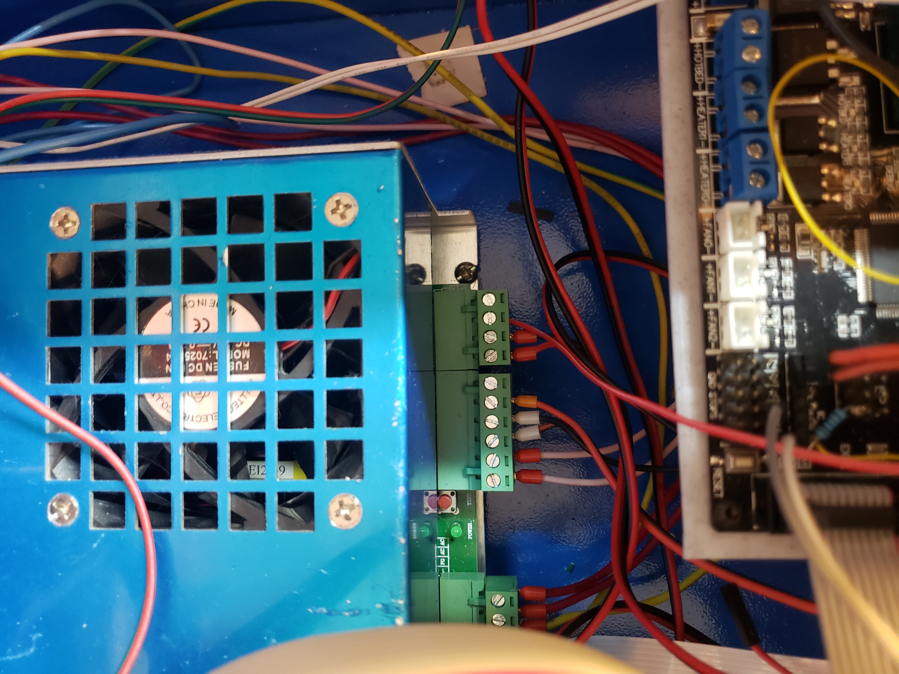
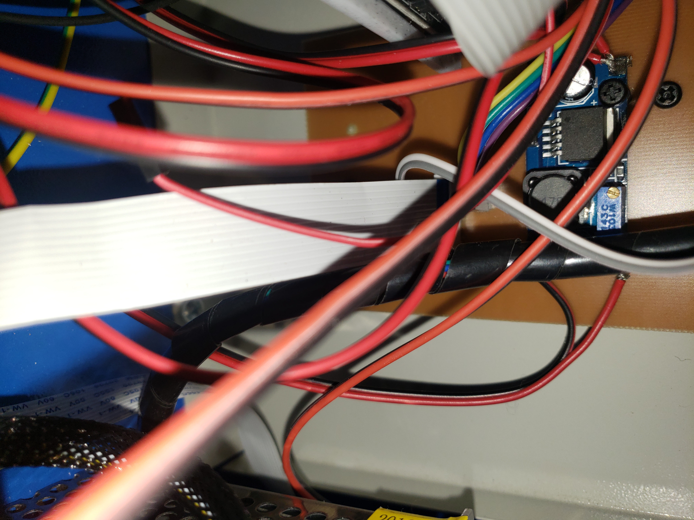
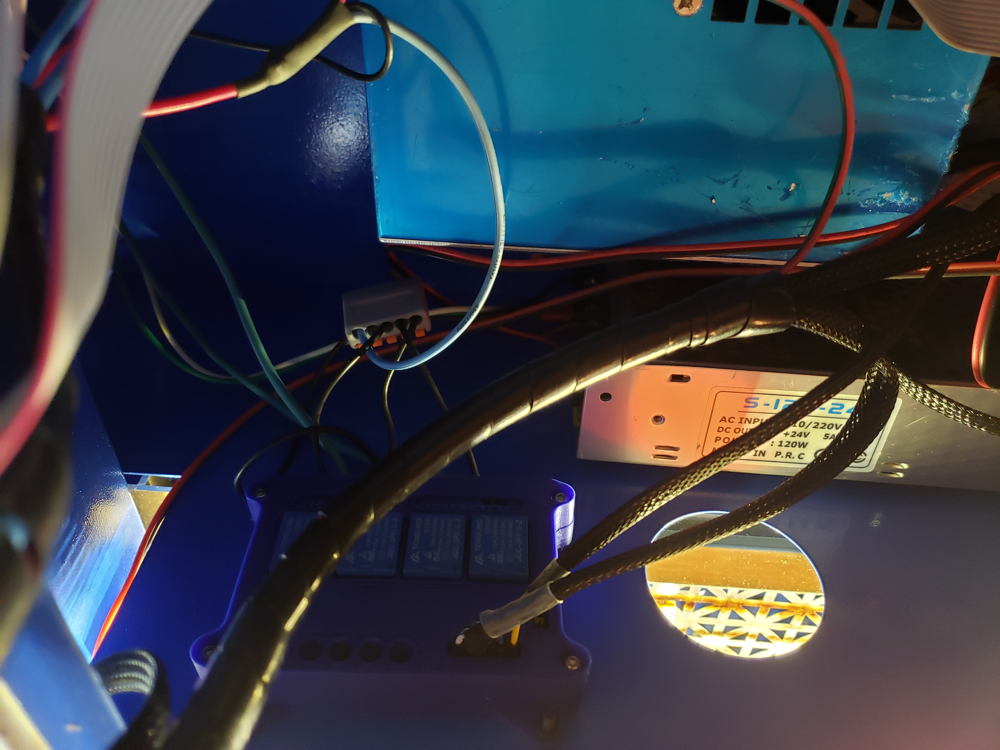
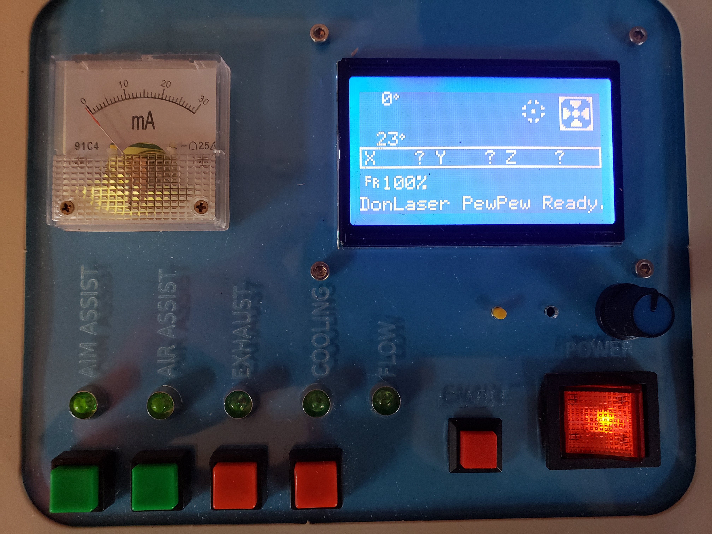
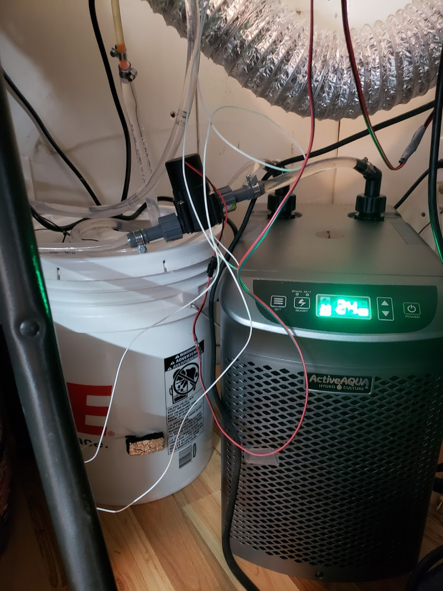

https://github.com/adam-p/markdown-here/wiki/Markdown-Cheatsheet#hr

# Making the K40 not suck, a simple plan.

## WARNINGS:
1. This is not going to go into modifying a RAMPS board to support 24V. 
   * If you're brave enough to try this, then use this [link](https://github.com/ExplodingLemur/presentations/wiki/K40-RAMPS-Conversion) to follow his instructions on modifying the board
2. An ability to either solder or spare cash to purchase parts.

# Baseline

This is a Marlin 2.0 build with all the normal laser options set. This is the same firmware configuration that's used in the top "Result" video. The switch from this to that was Lightburn adding support for Inline mode. A Regular Expression can be run on existing Lightburn output as follows:

* Export your gcode for Marlin to desktop. Open it in Notepad++ then:
  * replace all M03 with “I”
  * replace ^(I.+)[\n](G1.+)$ with $2 $1

^This is very much at your own peril. It works for me. I don't mind breaking my stuff.

# Results for just ramps, no stepper upgrade:

## Materials:

### Note on Materials: The initial write-up here is going to be just for RAMPS, then I'm going to add the stuff for my enclosure for exhaust/cooling/air assist, and then come back and add an addendum for using the LPC1768 board for Raster.

* RAMPS 1.4(Trigorilla or other **24V friendly**) *** MKS Board Sgen L V1
* K40 Breakout or skills 
  * https://oshpark.com/shared_projects/3W1BpcNl 
  * $15USD at https://awesome.tech/product/k40-middlemen-board/
  * BRD and SCH files included below for slim version
  * Connector part is linked from [this](https://github.com/ExplodingLemur/presentations/wiki/K40-RAMPS-Conversion) site, search for "connector for the cable"
* 4 Relay board **
* 5V laser diode **
* 3D Printer
* 24V PSU(Or run relay?) **
* 2A stepper for X(At least)

---
Goal: Make K40 not suck.

Inspiration/Source: http://3dprintzothar.blogspot.com/2014/08/40-watt-chinese-co2-laser-upgrade-with.html

## Breakout wiring
#### Note the Buck converter in this picture is used for something else later on.
These are difficult to see, but on my home-made K40 breakout we have:

|Wire Color| Purpose| Pin|
|-------------|-------------------|---|
|Red| 5V on RAMPS| Any available 5V|
|Black| GND on Ramps| Any available GND|
|4 Pin Dupont| X stepper|X motor|
|White| X Endstop| X- Signal|
|Grey| Y Endstop| Y- Signal|

Use this link to download the Eagle BRD file [Board File](media/k40_breakout/K40_MiddleMan_002A.brd)  
Use this link to download the Eagle SCH file [Board Schematic](media/k40_beakout/K40_MiddleMan_002A.sch)

## Board mount
I used [This thing](https://www.thingiverse.com/thing:2155376) to mount the Trigorilla board in my case. You can find others that will work for whatever RAMPS variant you have. The inpiration link above I think has one for a regule RAMPS even.

## Wiring RAMPS to Laser PSU
PSU Wiring:
#### Note that you may need to check the pinout on your PSU

Top connector(top to bottom)
* NC
* 5V going to any open 5V pin on RAMPS
* GND going to - of 5A input on RAMPS
* +24V going to + of 5A input on RAMPS
---
Bottom Connector(top to bottom)
* NC
* Laser PWM - 6 -- There are only certain pins this can go on because of timers. Leave it on 6 to be safe.
* GND going to any open - on RAMPS
* Laser Enable/Fire - 5 - This is just a digital IO so you can use whichever you want - 10K resistor to +5V here to stop sporadic turnon during boot if interlock is off
* One side of enable push-button toggle
* Other side of enable push-button toggle
---

## Step Calibration
An important part of getting Marlin right on your machine is making sure that distances are correct. If you move 20MM in X when you thought you were going 19MM then there's a bit problem.

This LightBurn file can be used to calibrate steps. There's a 20mmX20mm square with 5mm intervals and axis labels. Cut the outside and etch the inside, measure, and adjust until you get 20x20 with a caliper. Then cut the two triangles(one is rotated 90 degrees), if the two triangles stack up the same then your steps are at least correctly proportioned. 

Use this link to download the Calibration file [Calibration File](media/calibration/20mmSquareStepCal.lbrn)  

### 12V buck for Relays
Stepping 24V down to 5V to run switches and the relay coils

### Relay board

Runs: Cooling(water pump), Exhaust, and Air Assist via panel buttons

### Panel

Pretty basic in the grand scheme

## Water pump/flow indicator?

*** When hooking up the chiller and cutting my speed/power for MDF went from 10/32 to barely get through to 10/28.

This setup works just fine without the chiller in the loop for the K40 if you turn your pump off between using the laser. I found after a few hours the pump alone would heat the water up(only having 5Gallons doesn't help)

We have an aquarium pump in the bottom of a 5 gallon bucket.  
Outlet on it goes to the IN side of a chiller.  
Outlet of the chiller goes to the IN side of a 12V generator.   
Outlet of the generator then goes to the laser in.

Generator output then goes to the "FLOW" led on the panel. This needs some revision yet.  
There's a Thermistor stuck to the side of the bucket the pump is in and hooked up to TH0 on the RAMPS board to get water temp on the screen as well.

Water pump is controlled via one of the panel buttons and a relay using one of the original outlets on the back of the case(with wiring corrected)

**wire cleanup will come when I get my panel mount connectors this coming week.

## MKS Upgrade for Raster
---

---

